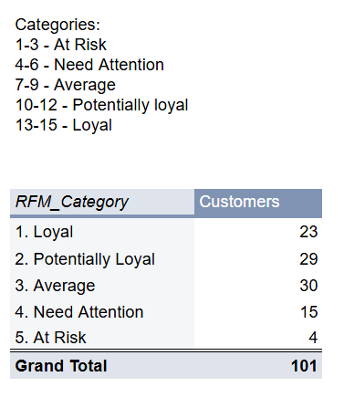
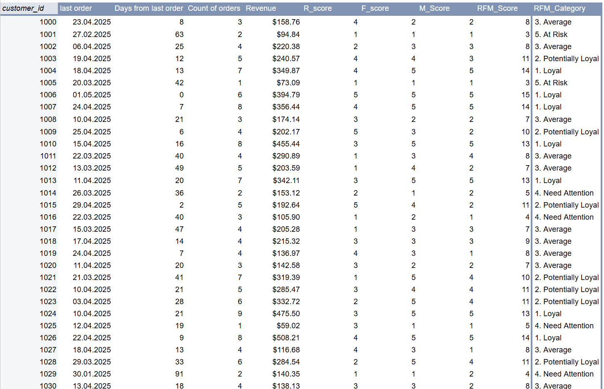

# RFM Analysis | Google Sheets 
### Who is your best customer?

When planning ad spend, you can't treat all customers equally. Segment your clients by their value to your business. One of the ways to do it is RFM segmentation — grouping customers based on recency, frequency, and monetary value.

I performed an RFM analysis using Google Sheets on a restaurant dataset of 101 unique customers to identify high-value segments and evaluate where retention efforts make the most sense.

Key takeaway: most customers fall into “average” or “potentially loyal” segments — which is pretty typical. Only a small group (4 customers) was classified as “at risk”, meaning they’re the lowest priority for retention campaigns.

 

This kind of segmentation helps you define which customers need a retention campaign and which ones you can deprioritize in your marketing budget: focus on high-value and potentially loyal customers, while reducing retention spend on low-value segments.

#### Results:
 
